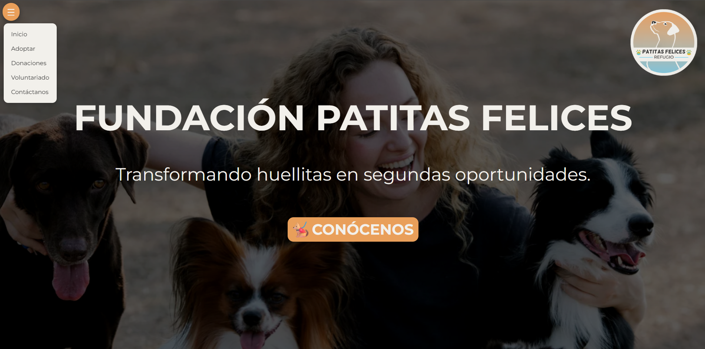
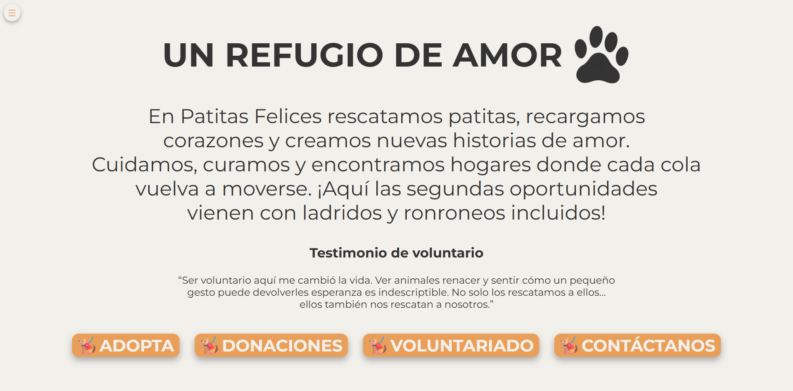
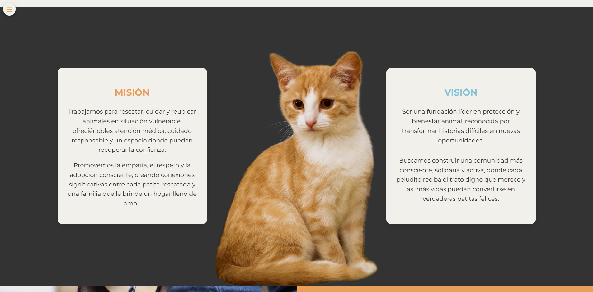
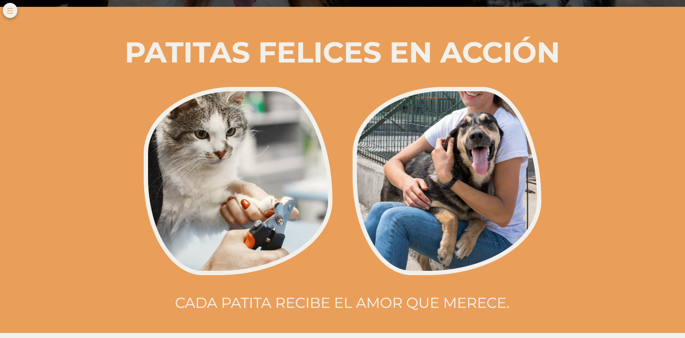
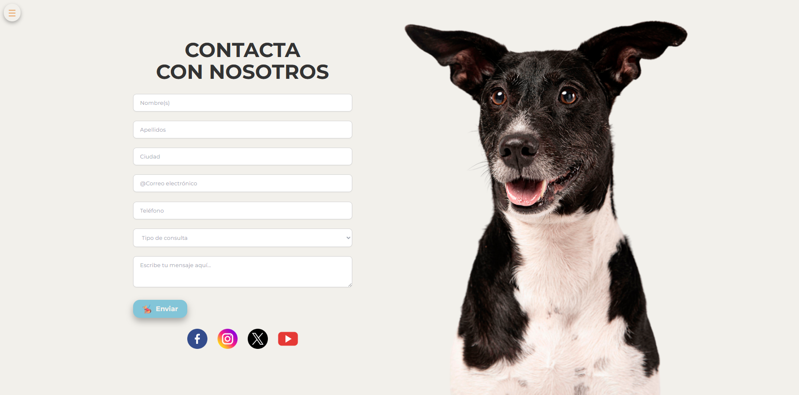
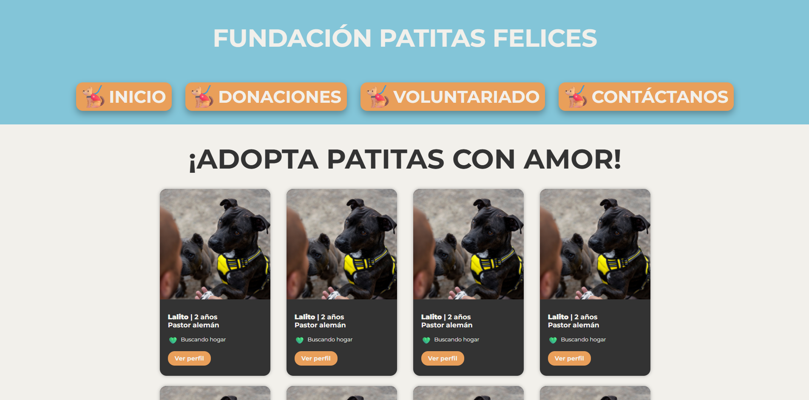
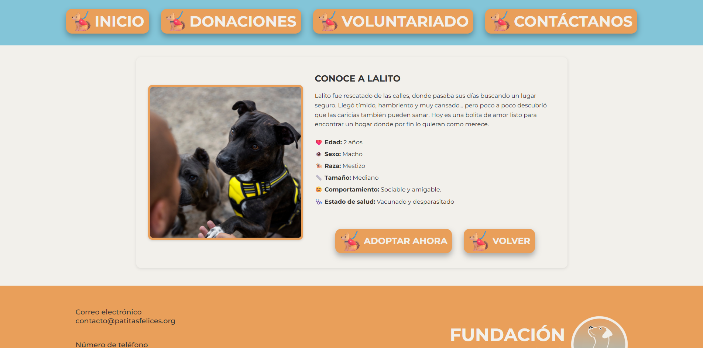
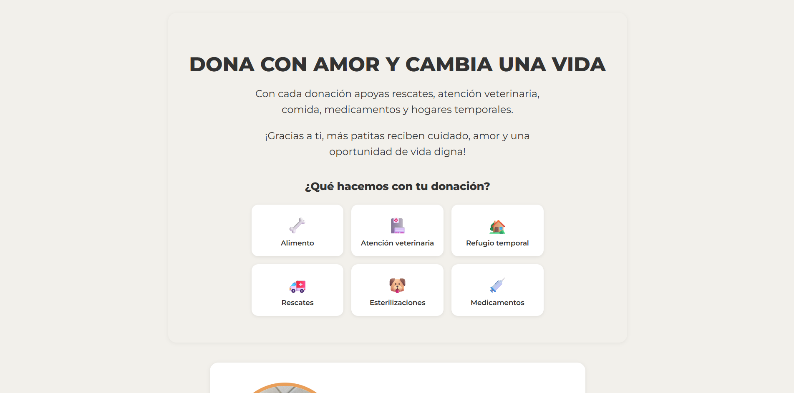
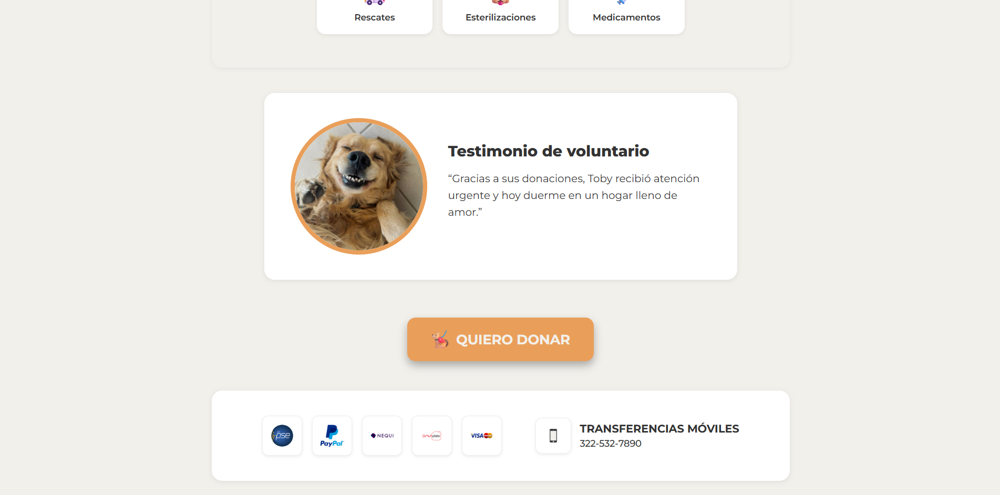
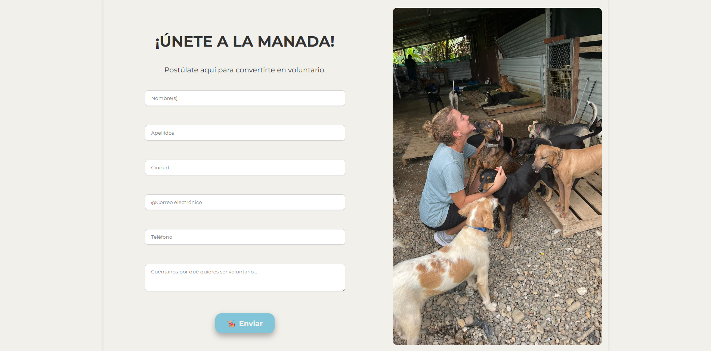

# 🐾 Fundación Patitas Felices

Static website for an animal rescue and adoption foundation, built with pure HTML5 and CSS3 — no frameworks, no external dependencies.

The site includes:

- A home page with welcome, mission/vision, featured stories, and contact sections
- An adoption catalog with individual profile pages for each animal
- A donations page with payment methods and mobile transfer info
- A volunteer application form
- A contact form for inquiries, adoptions, donations, and volunteering

---

## Tech Stack

- **HTML5** – Semantic structure and content
- **CSS3** – Visual styling, colors, typography, and layout
- **Flexbox and CSS Grid** – Responsive layout and grids
- **Google Fonts (Montserrat)** – Site typography

Fully responsive design with fluid typography and spacing (`clamp()`), and no external framework dependencies.

---

## Project Structure

```
patitas-felices-web/
├── index.html                     # Home page
├── LICENSE
├── .gitignore
├── css/
│   └── styles.css                 # Single stylesheet for the whole site
├── html/
│   ├── catalog.html               # Adoption catalog
│   ├── donations.html             # Donations page
│   ├── volunteering.html          # Volunteer application form
│   └── animal-profile.html        # Individual animal profile page
├── img/
│   ├── buttons/                    # Button icons
│   ├── carousel-01/                 # Photos for the home page's first carousel
│   ├── carousel-02/                 # Photos for the second carousel (stories)
│   ├── payment-icons/               # Payment method logos
│   ├── social-icons/                # Social media icons
│   └── ...                          # Other standalone logos and photos
├── docs/
│   └── main-views/                 # Screenshots used in this README
│       ├── index-views/             # Screenshots of the home page sections
│       ├── catalog-page.png
│       ├── donations-info.png
│       ├── donations-payment.png
│       ├── volunteering-page.png
│       ├── animal-profile-page.png
│       └── Maqueta de sitio web - Fundación Patitas Felices.pdf
└── README.md
```

**Project conventions:**
- File names in English, kebab-case (`dog-adopt.png`, `carousel-photo-1-1.png`).
- HTML/CSS IDs and classes in Spanish, lowercase (inherited from the original design).

---

## Features

- Fixed navigation (hamburger-style navbar) on the home page
- Animated photo carousels on the home page
- Responsive Mission/Vision section with a decorative illustration
- Adoption catalog with animal cards linking to individual profile pages
- Contact and volunteer forms with basic HTML5 validation
- Payment method logos visually normalized despite the original files having inconsistent proportions

---

## Setup

Clone the repository:

```bash
git clone https://github.com/jorgegmch/patitas-felices-web.git
```

Open `index.html` in your browser, or serve it with a Live Server-type extension so relative paths resolve correctly. No build step or dependencies required.

To edit content or styles, open the `.html` files or `css/styles.css` directly in any text editor.

---

## Main Views

### Home page

<table>
<tr>
<td><br/><sub><b>Hero</b></sub></td>
<td><br/><sub><b>About Us</b></sub></td>
</tr>
<tr>
<td><br/><sub><b>Mission & Vision</b></sub></td>
<td><br/><sub><b>Happy Paws in Action</b></sub></td>
</tr>
<tr>
<td colspan="2" align="center"><br/><sub><b>Contact</b></sub></td>
</tr>
</table>

### Catalog & Animal Profile

<table>
<tr>
<td><br/><sub><b>Adoption Catalog</b></sub></td>
<td><br/><sub><b>Animal Profile</b></sub></td>
</tr>
</table>

### Donations & Volunteering

<table>
<tr>
<td><br/><sub><b>Donations — Info</b></sub></td>
<td><br/><sub><b>Donations — Payment Methods</b></sub></td>
</tr>
<tr>
<td colspan="2" align="center"><br/><sub><b>Volunteering</b></sub></td>
</tr>
</table>

---

## License

This project is licensed under the [MIT License](LICENSE).

---

Built by [Jorge Gomez](https://github.com/jorgegmch)